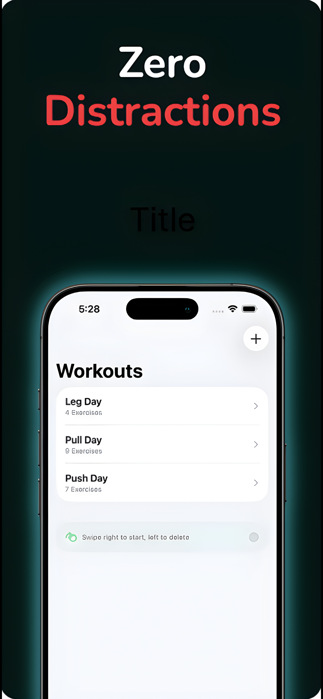

# LiftKit - iOS Workout Log

**Downloads: 38 and Growing**

**App Store Rating 4.5/5**

**App Store Link:** [Download on the App Store](https://apps.apple.com/us/app/liftkit-gym-workout-log/id6756804418)  
**Status:** v1.02, Freestyle mode now available!

[**Support Form**](https://forms.gle/frPivgKerdN6oJVF8)
## Overview

LiftKit is a native iOS application designed for strength training tracking with a focus on performance and minimal friction. Unlike commercial competitors that rely on web-views or subscription models, LiftKit is built as a fully native Swift application using modern Apple frameworks. With Privacy and Owning being the primary goal.

From an engineering standpoint my goal was to make this app standout by reducing the "time-to-log" for users while maintaining data integrity for long-term progress visualization.

<table>
  <tr>
    <td></td>
    <td></td>
    <td></td>
  </tr>
</table>

## Tech Stack

* **Language:** Swift 6
* **UI Framework:** SwiftUI
* **Data Persistence:** SwiftData (replacing Core Data for modern concurrency support)
* **Visualization:** Apple Charts Framework
* **Architecture:** MVVM (Model-View-ViewModel)
* **Version Control:** Git

## Basic Feature Flow

- **Custom Workout Templates:** Users can build reusable routine "blueprints" that auto-populate weight and rep targets based on previous sessions.
- **Active Session Mode:** A focused, distraction-free interface for logging sets in real-time and shows PR (Personal Record) for exercises globally supporting progress no matter the template the workout is in.
- **Progress Visualization:** Very important for weightlifting, Dynamic rendering of volume and 1RM (One Rep Max) trends using Swift Charts.
- **Offline First:** Full functionality without network requirements; all data is stored locally on-device. No data collection.
- **You Buy, You Own** No subscriptions or in app purchases

## System Architecture

The application follows a strict MVVM architecture to decouple logic from the UI.

* **Models:** Define the core data (`Workout`, `Exercise`, `Set`) using SwiftData.
* * **Views:** Basic SwiftUI views that observe the ViewModel state.
* **ViewModels:** Handle logic, such as calculating 1RM, validatng user input, managing the state of the active workout session, and storing and accessing data.

### Data Flow
1.  User initiates a workout -> ViewModel fetches the `Template` object.
2.  Session data is held in a temp state (`ActiveWorkoutManager`) to prevent trash values from abandoned sessions.
3.  Upon completion, the manager commits the transaction to the persistent SwiftData container. Seperating templates from sessions meaning progress between exercises is not lost if workout templates are changed/ deleted.

## Future Development
* **lbs to kg option**
* **WatchOS Support:** Standalone logging from Apple Watch.
* **CloudKit Sync:** Optional backup for users with multiple devices.
* **Haptic Feedback:** Custom vibration patterns for rest timer completion celebrating new PRs/ workout completions

## Contact

**Created By:** Kyce Harper.

[**Portfolio**](https://kyceharper.me/).

[**LinkedIn**](https://www.linkedin.com/in/kyce-harper-87a8212b2/).
